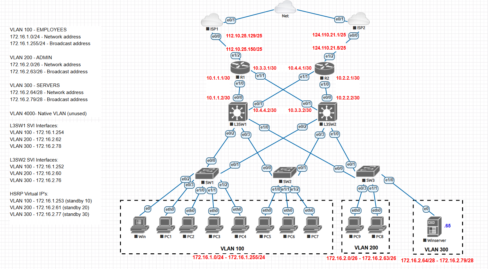

# Network Lab: VLANS | OSPF | HSRP | NAT | DHCP-Server | Port security | Inter-VLAN Routing |

This project demonstrates the design and implementation of a scalable and resilient enterprise network infrastructure built to support distinct user segments and ensure high availability for critical services.

### Project Summary
* Designed a scalable enterprise network with **VLANs** for segmentation and deployed **HSRP** for first-hop redundancy and gateway load balancing.
* Implemented **OSPF** for dynamic internal routing with dual-homed internet connectivity, configured a Windows Server for centralized **DHCP** via **DHCP Relay**, and secured the infrastructure using **port security** on access ports and **PAT** for secure internet access.

---

## Lab Environment
This lab was built and simulated using the following platform and virtual device images:

| Component | Details |
| :--- | :--- |
| **Platform** | EVE-NG (Emulated Virtual Environment - Next Generation) |
| **L3 Switches** | Cisco IOL (IOS on Linux) L3 Image: `i86bi_linux_12-adventerprisek9-ms.SSA.high_iron_20190423.bin` |
| **Routers** | Cisco Dynamips Image: `c7200-adventerprisek9-mz.152-4.S6.image` |
| **Switches** | Cisco IOL (IOS on Linux) L2 Image: `i86bi_linux_12-adventerprisek9-ms.SSA.high_iron_20190423.bin` |
| **End Devices** | Windows Server (for DHCP), Virtual PCs |

---

## Core Technologies and Protocols

| Category | Technology / Protocol | Purpose |
| :--- | :--- | :--- |
| **Switching** | VLANs, 802.1Q Trunking | Segmented broadcast domains for security and efficiency. |
| **Redundancy** | HSRP (Hot Standby Router Protocol) | Provided a redundant, load-balanced default gateway. |
| **Routing** | OSPF (Open Shortest Path First) | Enabled dynamic, robust internal route discovery. |
| **WAN** | Dual-Homed ISP Links | Ensured resilient internet connectivity. |
| **Security** | PAT, Port Security, ACLs | Secured the network edge and access layer. |
| **Services** | DHCP Relay | Centralized IP address management. |

---

## DHCP Server Configuration (Windows Server)
A Windows Server was configured to provide centralized DHCP services for all VLANs. The `ip helper-address` command on the L3 switches forwards client requests to the server.

**DHCP Scope and Options:**

**Address Leases:**

**Address Reservations:**

---
